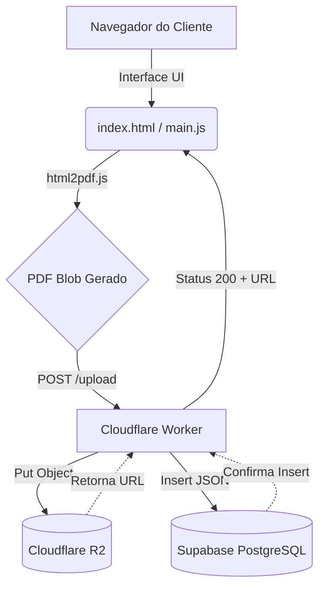
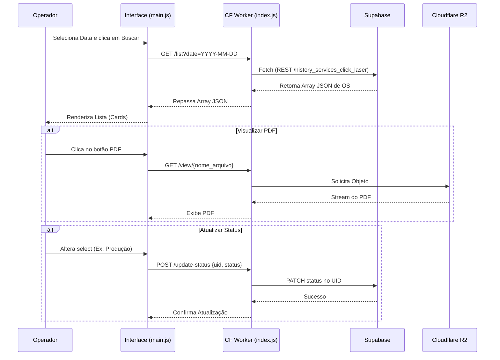

# 🏗️ Documentação Técnica: OS Click Laser

Este documento detalha a arquitetura, tecnologias e estrutura de diretórios do projeto **OS Click Laser**.

---

## 💻 Stack Tecnológica

- **Frontend:** HTML5, CSS3 (Custom Properties, Flexbox), Vanilla JavaScript.
- **Geração de PDF (Client-side):** `html2pdf.js` (converte o HTML invisível da área de impressão em um Blob/PDF).
- **Geração de QR Code:** `qrcode.min.js`.
- **Backend / API:** Cloudflare Workers (Edge Computing, processamento de baixo custo e alta performance).
- **Armazenamento de Arquivos:** Cloudflare R2 (Object Storage para PDFs).
- **Banco de Dados:** Supabase (PostgreSQL via API REST nativa).

---

## 📂 Estrutura de Diretórios

A estrutura física do projeto foi organizada visando a separação de responsabilidades (UI, Estilos, Lógica Cliente e Lógica Servidor):

```text
OS_Click_Laser/
│
├── fonts/                 # Contém os arquivos de fontes (.ttf, .otf)
├── scripts/
│   └── main.js            # Lógica do Frontend (Eventos, UI, geração PDF)
├── src/
│   └── index.js           # Lógica do Backend (Cloudflare Worker)
│
├── index.html             # Estrutura visual da aplicação
├── package.json           # Dependências de metadados do projeto
├── style.css              # Estilização Global, responsividade e layout de impressão
└── wrangler.toml          # Configuração de infraestrutura do Cloudflare Worker
```

---

## 🔄 Arquitetura e Fluxos de Dados

O sistema opera sob uma arquitetura serveless desacoplada, onde o cliente resolve cargas pesadas (renderização do PDF) localmente e o servidor apenas orquestra dados e arquivos.

### Diagrama de Arquitetura Geral



### Fluxo de Geração de Ordem de Serviço (OS)

1. Usuário preenche formulário em `index.html`.
2. O `main.js` injeta os dados na `div#printArea` oculta.
3. Biblioteca `html2pdf.js` escaneia a `div`, ajusta as regras do `@media print` e consolida um Blob PDF.
4. Envio multipart via `fetch()` para o Worker (`/upload`).
5. O Worker extrai o arquivo e o envia para o **R2_OS**.
6. O Worker monta o payload com os metadados (data, hora, origem, itens gravados em JSON) e cadastra via API do **Supabase**.
7. O Worker retorna o link público ao cliente.
8. `qrcode.js` lê o link gerado e insere no footer da OS.
9. A janela de impressão nativa (`window.print()`) é aberta para a impressora térmica.

### Fluxo de Consulta de Ordens



---

## 🛡️ Segurança e CORS

O arquivo `src/index.js` foi configurado para responder favoravelmente às requisições `OPTIONS` enviando os cabeçalhos de CORS. O acesso ao **Supabase** não é exposto ao cliente final; a Service Key (`SUPABASE_SERVICE_KEY`) reside estritamente nas variáveis de ambiente seguras do Cloudflare. O tráfego no R2 exige passagem via Worker na rota `/view/` para garantir que recursos não listados permaneçam privados.
